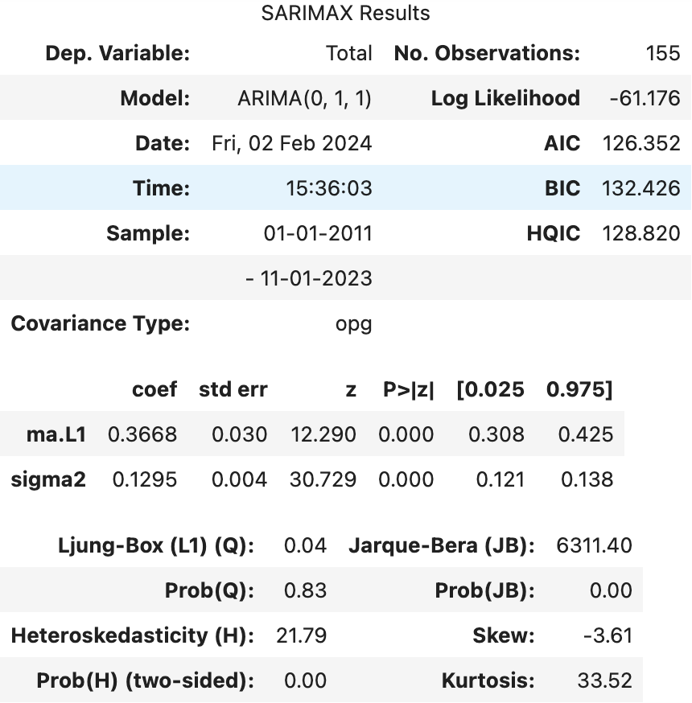

# Time series forecasting using ARIMA and PyCaret 

### *What we can learn from tourists visiting Taiwan before and after pandemic?* 

### Table of Contents
* [Introduction](#Introduction)
* [Data Wrangling](#Data_Wrangling)
* [Exploratory Data Analysis](#EDA)
* [Pre-processing Work](#Pre-processing_Work)
* [Modeling](#Modeling)
* [Conclusion](#Conclusion)
* [Future Directions](#Future_Directions)

### Introduciton

Taiwan's travel and tourism industry plays a significant role in its economy, contributing to economic growth, job creation, and cultural exchange. The foreign exchange earnings from tourism for the year 2019 were estimated to be 14.41 billion US dollars, which was 4.43% of Taiwan's GDP. The total number of visitors to Taiwan in 2019 also reached an all-time-high record, 11.85 million.

However, after the outbreak of COVID-19, the total number of tourists was down 98.82% to less than 0.14 million in 2021. As a result, the foreign exchange earnings from tourism also dropped drastically, from 14 to 1.8 billion US dollars. The goal of this study is **to determine whether visitors to Taiwan are increasing, declining or being stagnant before pandemic and to build a time series model that forecasts the future number of visitors from the perspective of the past.**

The result of this study can be used as a guidance and empower the Taiwan Tourism Bureau to make informed decisions, optimize resource utilization, reform marketing strategis, and enhance the overall tourism ecosystem in Taiwan.

### Data Wrangling

[Data Wrangling Notebook](./Notebooks/25.3.1_Capstone%203_Data%20Wrangling%20&%20EDA.ipynb)

The key data source is a single CSV file, with 29454 rows and 20 columns, which can be downloaded from [Taiwan Tourism Bureau](https://stat.taiwan.net.tw/). It contains the monthly number of visitors to Taiwan by their gender, residence and purpose from January 2011 to November 2023. Although the original dataset is relatively clean and does not contain missing values upon initial inspection, we can see that it is not in a favorable format and does require additional data wrangling work. For example, we are not particularly interested in the gender information and have to reshape our data frame by unpivoting the gender in each purpose categories.

After looking into the two categorical features, we learned that this dataset contains a total of 184 residence regions, along with an additional category labeled as `'Unknow.'` Furthermore, all of the visitors were categorized into the following 8 groups based on their purporse of travel: 

 - **Business**
 - **Leisure**
 - **Visit Relatives**
 - **Conference**
 - **Study**
 - **Exhibition**
 - **Medical Treatment**
 - **Others**

### Exploratory Data Analysis

[EDA Notebook](./Notebooks/25.3.1_Capstone%203_Data%20Wrangling%20&%20EDA.ipynb)

#### 1. Is there any trend in the total number of visitors from 2011 to 2023?

The first thing we would like to know is the general trend in the total annual number of visitors over the decade since 2011. It seems that the influx of visitors to Taiwan has exhibited an upward trajectory since 2011, culminating in a record high of 11.85 million in 2019. Nevertheless, due to the global pandemic, there was a significant downturn in 2020, with the figure plummeting further to 140 thousand in 2021—less than 2% of the unprecedented peak recorded in 2019.

#### 2. Is there any seasonal fluctuation in the total number of visitors from 2011 to 2023?

After plotting the monthly visitor number instead of the annual sum, we can see there is definitely a seasonal pattern in the total number of visitors. The number started to climb up from the beginning of each year, reached the first peak in spring, and declined towards the summer. Afterwards, it rised again and reached the second peak in fall, and decreased towards the end of each year. However, this pattern was only evident before the outburst of pandemic.

#### 3. What were the top 20 countries of residence that visitors to Taiwan came from in the most recent three years before pandemic (2017-2019)?

In addition to the general trend and sesonal pattern, it will be very interesting to explore which country demonstrated a particular fondness for visiting Taiwan in the three years leading up to the pandemic. We exclusively focus on the data before 2020, as post-pandemic visitor trends were substantially influenced by travel restrictions imposed by respective countries, which may not accurately capture the essence of this inquiry. As you can see in the above horizontal bar chart, Mainland China loves to visit Taiwan the most during 2017-2019, followed by Japan, Hong Kong, Korea, and USA.

#### 4. What were the top 20 countries of residence that visitors to Taiwan came from during 2011-2013?

In order to figure out if the same trend held true a decade ago, we further look into the data from 2011 to 2013. Despite the total number of visitors during 2011-2013 is lower than that of the most recent three years, the ranking of the number is mostly similar to 2017-2019. Some countries have more drastic change in the total number now and then, e.g. the number of visitors from Korea, Vietnam and Philippines during 2011-2013 was roughly one fourth of the total visitors recorded between 2017 and 2019.

#### 5. What was the main travel purpose for visitors to Taiwan during 2011-2023?

Finally, we investigate the distribution of travel purpose over the 13 years. We already knew that Taiwan Tourism Bureau grouped visitors into 8 categories. Thus, it would be very intriguing to know which category accounts for the majority of tourists visiting Taiwan each year. As we expected, majority of visitors to Taiwan were for leisure or recreational purposes. Despite the fact that the distribution changed after the outbreak of global pandemic, overall the distribution of travel purpose to Taiwan remained similar throughout the decade.

### Pre-processing Work

[Pre-processing Work Notebook](./Notebooks/27.1.1_Capstone%203_Pre-processing%20Work%20%26%20Modeling.ipynb)

Time series data encompasses the representation of how a single variable changes over time. It usually contains a sequence of metrics collected at consistent intervals. In our case, this includes the monthly number of visitors to Taiwan. In our previos EDA, we already learned that there is a upward trend in visitors to Taiwan from 2011 to 2023 despite a drastic downturn in 2020 due to the Covid-19. There is also a seasonal pattern in the total number of visitors with a repeated pattern. 

Because the general trend does not increase at a steady speed and the amplitude of seasonal fluctuations gets bigger as time progresses, our data should be multiplicative. As a result, we can use a multiplicative model to decompose the data, breaking it into the following three components: **Trend, Seasonality, and Noise.**

> Decompose the time series data and plot the trend, the seasonality, and the residuals

We have to assess stationarity when performing time series analysis. A time series dataset is deemed stationary when its statistical characteristics remain constant over time, which means the series exhibits a consistent mean, variance, and covariance. KPSS is one of the most widely used methods for testing stationarity. The null hypothesis of the KPSS test suggests that the examined time series data is stationary. Therefore, if the p-value falls below the chosen significance level (typically 0.05), we reject the null hypothesis and conclude that the data lacks stationarity. Since our p-value, 0.023, is less than 0.05, we should reject the Null hypothesis and deduce the non-stationarity of our data.

Alternatively, we can check stationarity using the Dicky-Fuller test. The Null hypothesis of this test is that the time series data has a unit root, indicating it is non-stationary. If the *p*-value is less than the significance level, we reject the Null and infer that the data is stationary. Keep in mind that **a significant *p*-value means stationary in `adfuller()` but opposite in `kpss()`.** Since our p-value, 0.381, is larger than 0.05, we could not reject the Null hypothesis and deduce the non-stationarity of our data, which is consistent with KPSS. However, we need our data to be stationary before building a predictive model.

> Both the KPSS and Dicky-Fuller test indicate that our data is not stationary

It is evident that both the mean and variance of our data increase over time, which suggests that it lacks a consistent mean and variance. As a result, we will have to transform our data and make it stationary.

> Plot the data after natural log transformation

After log transformation, we can see that the variance in our data now remains more contant over time than that before transformation. Although we have a constant variance, we also need a constant mean. At this moment, our p-value of KPSS test, 0.014, is still less than 0.05, indicating non-stationarity. We can achieve a constant mean by differencing our data. Differencing involves creating a new time series that represents the difference between consecutive values in our existing dataset. We can use the `diff()` function for this purpose.

> Plot the data after log transformation and differencing

We further test stationarity with KPSS after natural log transformation and differencing. The resulting p-value of KPSS test, 0.1, is now greater than 0.05, so we can accept the null hypothesis that our data is stationary. When we use `adfuller()`, p-value is much smaller than 0.05, suggesting that we could reject the Null hypothesis and our data is stationary (not a random walk). In this case since both tests indicate stationarity, the series can be deemed to be trend-stationary. Trend-stationarity implies difference-stationarity, but the reverse is not necessarily true. Keep in mind that if the KPSS test indicates stationarity and the Dicky-Fuller test indicates non-stationarity, it's a sign that the series is only difference-stationary. 

Using both tests ensures us that we avoid misinterpreting the type of stationarity or the presence of a trend in the data. In practice, the goal is often to make the data either difference-stationary, trend-stationary, or both, depending on the characteristics of the time series. Many time series models, like the popular ARIMA (AutoRegressive Integrated Moving Average) model, are designed to work with difference-stationary data. These models often involve differencing the original series to achieve stationarity.

White noise is a special case of a stationary time series. It is characterized by a constant mean, a constant variance and no autocorrelation. However, it is also characterized by its lack of discernible patterns, structure, or correlations between observations. Because of its randomness and lack of patterns, white noise is inherently difficult to predict. Therefore, we will further examine the Autocorrelation Function (ACF) plot of our data.

After plotting ACF, we found there is at least one lag, other than lag 0, is significantly different from zero in the ACF, which suggests the presence of autocorrelation in our time series data. Because autocorrelation is detected, it might be appropriate to consider more complex models that capture the temporal dependencies in the data. This could involve ARIMA models or other sophisticated time series models.

In order to generate an ARIMA model, we have to estimate the order (p, d, q) of the model. There are multiple ways to find good parameters of our model, e.q. using Autocorrelation Function (ACF) and Partial Autocorrelation Function (PACF) to choose model order. However, ACF and PACF rarely gave us a conclusive model choice in my experience and we should always loop over multiple parameters to find the best model order. Herein, we will try the following two ways to identify the optimal order of an ARIMA model.

The first method is to calculate the root mean squared error (RMSE) and mean absolute error (MAE) between our predictions and true values. We implemented the one-step approach to calculate RMSE and MAE because it provides a more dynamic and accurate measure of the model's performance in a real-world scenario. In this approach, predictions are made, true values are observed, and subsequent predictions are then generated. The resulting RMSE/MAE calculated through this method offers a potentially more precise representation of the model's out-of-sample performance, capturing the nuances of the prediction-observation process in a dynamic setting.

> Optimize ARIMA model order (p, d, q) by RMSE and MAE

The other tool is to look at the Akaike Information Criterion (AIC) and the Bayesian Information Criterion (BIC). These measures compute the goodness of fit with the estimated parameters, but apply a penalty function on the number of parameters in the model. The main difference between AIC and BIC is how much they penalize the complexity of our model. AIC is often preferred when we have a larger sample size and are willing to accept slightly more complex models, while BIC is favored when we have a smaller sample size or when we want to strongly favor simplicity.

> Optimize ARIMA model order (p, d, q) by AIC and BIC

As you can see in the above two tables, ARIMA(1, 0, 1) model has the lowest RMSE, 0.39137, while ARIMA(0, 1, 1) model has the lowest MAE, 0.27169. When we apply an AIC-BIC order search, the best p, d, q parameters for our ARIMA model are 0, 1, 1, which is consistent with the previous MAE approach. We further examine the RMSE of this particular ARIMA(0, 1, 1) model, of which the RMSE is 0.39251 and quite comparable to the ARIMA(1, 0, 1) model. Keep in mind that AIC and BIC both favored the same model ARIMA(0, 1, 1) in this scenario, but this won't always be the case.

### Modeling

[Modeling Notebook](./Notebooks/27.1.1_Capstone%203_Pre-processing%20Work%20%26%20Modeling.ipynb)

Given that MAE, AIC and BIC all favor the same model ARIMA(0, 1, 1), we will use the p, d, q order (0, 1, 1) to build an ARIMA model and take a look at a summary of the model this library has built around our data.

Based on the summary p-value of Ljung-Box (L1) test, we cannot reject the null hypothesis of the test and should accept that there is no autocorrelation in the residuals of the time series. The L1 test is particularly employed to evaluate whether the residuals (or errors) of a time series model exhibit significant autocorrelation. If significant autocorrelations are detected, it indicates that there may be room for improvement in the model.

However, the p-value of the Jarque-Bera (JB) test in the summary is exactly zero, it typically indicates that the data's distribution significantly deviates from a normal distribution. The JB test is a statistical test for assessing the skewness and kurtosis of a sample, and it is often used to check the normality assumption of the residuals in a regression or time series model. We can further examine other diagnostic plots and tests for residuals using `plot_diagnostics()`.

> Plot diagnostics to examine the pattern, distribution, and correlation of residuals

The histogram and Q-Q plots indeed both show that the residuals from our ARIMA model do not exactly follow a normal distribution. Typically, if the residuals are not normally distributed, we would consider revisiting the model and applying transformations to remove outliers. In this case, we acknowledge that the deviation was caused by an unprecedented and dramatic downturn in data, namely the onset of the global pandemic in early 2020. These sudden and unforeseen events pose a challenge to ARIMA, as the model struggles to effectively handle such extraordinary disruptions.

ARIMA models assume that the residuals are normally distributed. If the residuals are significantly non-normal, it may compromise the reliability of the model's parameter estimates and predictions. While ARIMA models are generally robust to departures from normality, severe deviations, akin to the impact of the COVID-19 outbreak, may considerably distress the model. Thus, we further visualize the original dataset plotted against the predicted values and examine the overall fitting of our ARIMA model.

> Plot the original series and the predicted series

It seems that our model fits tightly to our existing data. We will further use it to forecast the number of future visitors over the next 24 months.

> Plot future predictions for the next 24 months

We can see that ARIMA(0, 1, 1) forecasts more than one period in the future are simply equal to the first forecast of the sample. This issue could be attributed to the behavior of the ARIMA model and the chosen parameter settings. If the time series data does not contain sufficient information or exhibits randomness, the ARIMA model may struggle to discern meaningful patterns, leading to less informative forecasts.

Because this behavior makes the model less useful for long-term predictions, we should consider alternative models to improve its effectiveness in forecasting . Depending on the nature of the time series, other forecasting models (e.g., SARIMA, exponential smoothing methods) might be more appropriate. We should experiment with different models to find the one that best fits our data.

We will use PyCaret, a low-code machine learning library in Python that automates machine learning workflows, to explore the performance of different time series forecasting models and select the best one. In this study, we use the PyCaret built-in function `setup()` to initialize the training environment and create the transformation pipeline. This function analyzes the time series data automatically and provides a detailed summary of global variables. We will use these default settings to compare various models in the library and generate a table of performance metrics.

> Evaluate performance of top 6 estimators available in the model library using cross validation

In this preliminary experiment, the Bayesian Ridge model highlighted at the top exhibits the lowest error scores and outperforms all other models. Will it be the most suitable forecasting model for our data? We will plot the forecast for the next 24 months to find out.

> Plot the best model’s (Bayesian Ridge's) forecasting for the next 24 months

Surprisingly, the Bayesian Ridge model predicts another downturn in the next 24 months, which contradicts our expectation and common scenario based on the potential trajectory of the travel industry during a recovery phase post-pandemic. As far as we understand, there has been a notable surge in visitor numbers, marking a robust rebound following the global pandemic.

In fact, most top performers on the aformentioned table of performance metrics yield a similar downtrend. We will further look into other alternatives that potentially can forecast a more reasonable outcome in our case. Specifically, we will use the `create_model()` function to generate additional models of interest (i.e. SARIMA and Exponential Smoothing) and plot them.

> Plot the forecasting of SARIMA model for the next 24 months

> Plot the forecasting of Exponential Smoothing model for the next 24 months

Both the SARIMA and Exponential Smoothing models anticipate an upward trend in the number of incoming visitors to Taiwan over the next 24 months. This forecast appears to be more plausible than that generated by the Bayesian Ridge model, despite a slightly higher error score. 

### Conclusion

* We confirmed the continuous growth in visitors to Taiwan since 2011. Despite the unforeseen and unprecedented decline in the flux of tourists due to Covid-19, we were able to successfully construct an ARIMA model with satisfactory fitness.

* Furthermore, we utilized PyCaret to develop two predictive models that effectively leverage past data to make realistic forecasting. The key takeaway is that selecting the best model cannot be solely determined by performance metrics. In addition to model fitness, ensuring the resulting forecast is meaningful and sensible is equally crucial. We should always use our best discretion and leverage domain knowledge to choose the most appropriate model for our specific case.

### Future Directions

* ARIMA model architectures offer greater interpretability compared to recurrent neural network (RNN), while RNN is recognized for its ability to produce more precise predictions. Having gained a solid understanding of ARIMA by building it from ground up, we could further explore RNN and other deep learning models for time series forecasting.
